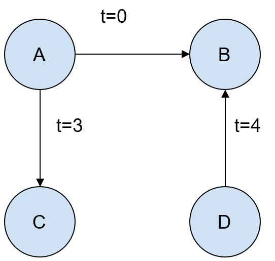
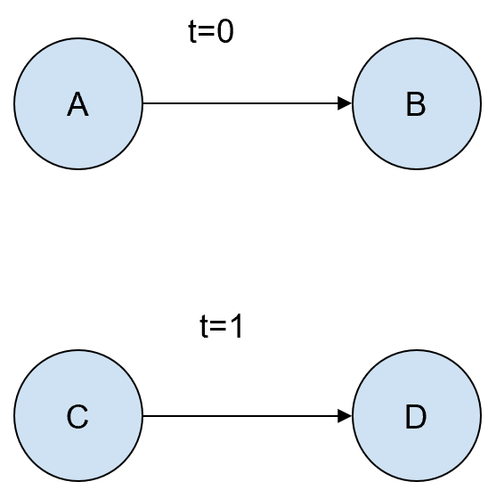
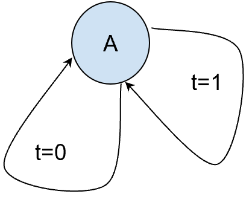

# MP2: Analyzing Email Interactions

## Motivation:
 
In this mini-project, we aim to develop a system to analyze email interactions of users within organizations. This is to gain insights about usage patterns, discover social interactions within the institution, and understand the impacts of potential vulnerabilities.  
 
## Primary dataset:
 
Email interactions between 986 users at a research institution for over two years, including sender user ID, receiver user ID, and send time of 332,334 emails. The data is provided in a single file in “txt” format.   
Link to the open-source data: https://snap.stanford.edu/data/email-Eu-core-temporal.html  
Effectively, you are given the data for a directed temporal weighted graph in the ```resources``` folder.  
 
## Task 1: Constructing the Interaction Graph and Collecting Basic Metrics
 
A graph is a suitable representation of the interaction between different users. However, depending on which question we want to answer, different graph representations might be more suitable.  
 
### Task1.1: 
A rich form of capturing email interactions is by using a directed graph. For this, you should implement a class called ```DWInteractionGraph```. It represents a directed weighted graph of user interactions within a specific window of time. Assuming two users A and B, directed means emails from A to B should be captured separately from B to A, and weighted means that the number of emails from A to B should be captured. This class should capture email times, as certain analyses would rely on it. An object of this class should be constructed in one of the following ways:  
1. 	Using an **input file** (similar in format to the one provided to you) and a **time window** (int array of length two: ```[StartTimeInSeconds, EndTimeInSeconds]```). Only email interactions that occurred in this window should be stored in the object, where the time window is inclusive. If no time window is provided, all email interactions in the file should be included.  
2. 	From another ```InteractionGraph``` object and a **time range filter** (int array of length two: ```[StartTimeInSeconds, EndTimeInSeconds]```) Note that the time window for the resulting object would be the intersection of input time range filter and the input object’s.
3. 	From another ```InteractionGraph``` object and an int array containing **user IDs**. The returning ```InteractionGraph``` should only contain interactions of these users. Note that not all requested users are guaranteed to be in the input ```InteractionGraph``` object. Interactions should be added to the new graph as long as either the sender or the reciver is in the specified array, or both.
 
### Task 1.2: 
A more simplified format of capturing the interactions is via an undirected graph. The class to be implemented for this is called ```UDWInteractionGraph```, for an undirected weighted graph of user interactions within a specific time. Assuming two users A and B, undirected means emails from A to B are not differentiated from those sent from B to A, and weighted means that the total number of emails between A to B should be captured. This class should also capture email times, as certain analyses would rely on it. An object of this class should be constructed in one of the following ways:  
1. 	Using an **input file** (similar in format to the one provided to you) and a **time window** (int array of length two: ```[StartTimeInSeconds, EndTimeInSeconds]```).   
2. 	From another ```UDWInteractionGraph``` object and a **time range filter** (int array of length two: ```[StartTimeInSeconds, EndTimeInSeconds]```) Again, this time window should be checked to fit in the time window associated with the input object, where the time range is inclusive.   
3. 	From another ```UDWInteractionGraph``` object and an int array containing **user IDs**. The returning ```UDWInteractionGraph``` should only contain interactions of these users. Interactions should be added to the new graph as long as either the sender or the reciver is in the specified array, or both.
4. 	From an ```InteractionGraph```. Here, the ```InteractionGraph``` should be translated into a ```UDWInteractionGraph```.  
 
**Note 1**: Part of solving this task is deciding a suitable data structure for holding data of a ```DWInteractionGraph``` or a ```UDWInteractionGraph```. There are two common ways to represent a graph: using an [adjacency matrix](https://en.wikipedia.org/wiki/Adjacency_matrix), or an [adjacency list](https://en.wikipedia.org/wiki/Adjacency_list). Depending on the graph, one could be better than the other in terms of speed or memory usage. Your ability to finish Task 4 and pass tests in a reasonable time may depend on choosing the representation better suited to this problem.  

## Task 2: Reporting Basic Metrics
 
The ```DWInteractionGraph``` class should implement the following public methods:

| Method Name | Parameters | Returns |
| --- | --- | --- |
| ReportActivityInTimeWindow | Time window in seconds: ```<int, int>```<br> Time window is inclusive on both boundaries. | [NumberOfSenders,<br />NumberOfReceivers,<br />NumberOfEmailTransactions]:<br />```<int, int, int>``` |
| ReportOnUser | User ID: ```<int>``` | [NumberOfEmailsSent,<br />NumberOfEmailsReceived,<br />UniqueUsersInteractedWith]:<br />```<int, int, int>```<br>If the User ID cannot be found in the graph, returns [0,0,0] |
| NthMostActiveUser | N: ```<int>```,<br />interactionType: ```<SendOrReceive>``` (‘SendOrReceive.SEND’ or ‘SendOrReceive.RECEIVE’) | User ID: ```<int>```<br>If two or more User IDs send or recieve the same number of emails, returns the smallest User ID in the most active set. |

The ```UDWInteractionGraph``` class should implement the following public methods:

| Method Name | Parameters | Returns |
| --- | --- | --- |
| ReportActivityInTimeWindow | Time window in seconds:<br />```<int, int>``` | [NumberOfUsers,<br />NumberOfEmailTransactions]:<br />```<int, int>``` |
| ReportOnUser | User ID: ```<int>``` | [NumberOfEmails,<br />UniqueUsersInteractedWith]:<br />```<int, int>``` |
| NthMostActiveUser | N: ```<int>``` | User ID: ```<int>``` |

## Task 3: Reporting More Advanced Metrics

The ```DWInteractionGraph``` class should implement the following public methods:

| Method Name | Parameters | Returns |
| --- | --- | --- |
| BFS | User 1 ID ```<int>```,<br />User 2 ID ```<int>``` | Returns: ```List <Integer>```<br />Using the breadth first search (BFS) algorithm, find whether there exists a path between User 1 and User 2. If such a path exists, this method should return the list of User IDs in the order visited. If no such path exists, the method should return null. When choosing the next adjacent node to vist, choose the node with the smallest User ID first that has not yet been visited.<br />More on BFS: https://en.wikipedia.org/wiki/Breadth-first_search |
| DFS | User 1 ID ```<int>```,<br />User 2 ID ```<int>``` | Returns: ```List <Integer>```<br />Using the depth first search (DFS) algorithm, find whether there exists a path between User 1 and User 2.  If such a path exists, this method should return the list of User IDs in the order visited. If no such path exists, the method should return null. When choosing the next adjacent node to vist, choose the node with the smallest User ID first that has not yet been visited.<br />More on BFS: https://en.wikipedia.org/wiki/Breadth-first_search |

The ```UDWInteractionGraph``` should implement the following public methods:

| Method Name | Parameters | Returns |
| --- | --- | --- |
| NumberOfComponents | No input parameter | Number of components of the graph: ```<int>```<br />Description: Number of completely disjoint graph components.<br />Examples: <br />
|  |  | 1.  Email interaction history of [[A,B,0],[A,C,3],[D,B,4]] ⇒ the interaction graph has only one component. 
|  |  | 2.  Email interaction history of [[A,B,0],[C,D,1]] ⇒ the interaction graph has two components. 
|  |  | 3.  Email interaction history of [[A,A,0],[A,A,1]] ⇒ the interaction graph has one component. 
| PathExists | User 1 ID ```<int>```,<br />User 2 ID ```<int>``` | Whether a path exists between the two users: ```<bool>```<br />(Hint: you can use breadth first search (BFS) or depth first search (DFS) for this.)

## Task 4: Malware Distribution Risk
 
Given that all users belong to the same institution and are being served by the same email server, they are exposed to a somewhat similar set of vulnerabilities. Thus, a hacker can exploit a potential vulnerability to quickly pollute a significant portion of the users.  
 
Let us assume that the hacker can only send one email containing a malicious attachment. This is because sending more external emails might reveal a pattern making it easy for the firewall to detect it. Thus, the attacker is relying on the internal spread of the malware. This means when victim number 1 sends emails to their colleagues, they spread the malware, and so on. The firewall is triggered N hours after receipt of the first email to victim number 1.  

Users may be infected and pollute downstream users at the exact same time that the hacker starts the attack. However, if the hacker attacks at time ```th```, and the firewall triggers ```n``` hours later, users receiving emails at time ```t >= th + n``` will not be polluted.
 
In hindsight and having access to an email interaction record, one can calculate the maximum number of users that can be polluted in N hours. This is exactly what you should do in this task. You should implement the ```MaxBreachedUserCount``` method in the ```DWInteractionGraph``` class, which takes as input parameter ```hours (<int>)``` and returns the integer (```int```) count of maximum polluted users. Note that:  
-  All interaction times in the input file are in seconds, but the input provided to this function is in hours.  
-  This problem is equivalent to finding the time for the first email and the right victim number 1, to maximize the number of users receiving malicious emails in N hours.  

----- 

### Implementation and Testing
* Follow the CPEN 221 Java Style Guide when you write code.
* You can check that your code conforms to the guidelines by using the Check Style feature of the Checkstyle Plugin.
* Construct test cases that will help you test all aspects of your implementation. As you write tests, use IntelliJ's code coverage tool to evaluate the coverage of the tests. You should achieve 100% class coverage and at least 90% lines-of-code coverage and at least 85% branch coverage via your tests. See the provided test cases as examples. Add your test cases in a different Java file. For obtaining test coverage information using IntelliJ IDEA, see [this documentation page](https://www.jetbrains.com/help/idea/running-test-with-coverage.html#read-coverage%20report), which also discusses how you can enable branch coverage.
* You may only use standard Java datatypes that you can import from `java.util`, `java.text`, `java.net` and `java.io`. (No javafx or other imports.)
* You are expected to write helper methods (usually, though not always, private methods) to keep individual methods small.

### Specification
You are expected to write clear specifications for all methods that you implement unless a complete specification has been provided.

### Directory Structure and Gradle
We use `gradle` as a tool to compile your programs and run test cases. [Gradle](https://gradle.org/) is a build system that handles a variety of tasks that enable us to compile, test (and even deploy) our applications.

You should preserve the directory structure for the codebase. 
All your main implementation must be in the directory `src/main/java/cpen221/mp2`. 
If you introduce new classes then they should also be in the same directory and would need the statement package mp2; at the top of the Java file. 
All your tests should be in the `src/test/java/cpen221/mp2` directory. 
Changing the directory structure will break the build process and your work will not receive any credit if your alter the directory structure.

### Submission
You will submit your work via GitHub, by pushing your work to the `main` branch of repository that was created for you.

### Intermediate Milestone
This is an opportunity to get some feedback from the TAs. We are not looking for perfect implementations at the intermediate milestone but *sufficient* progress (e.g., most of the requested methods work but have minor bugs; testing coverage is not at the desired level). *Insufficient progress* will result in a lowered grade.

You should aim to complete -- at the least -- Tasks 1 and 2.

You should push your work to the GitHub repository that you are using. 
Create a new branch called `milestone1` and push this branch to GitHub for the intermediate milestone. 
Read the module on git and branching (on Canvas). 
This [tutorial](https://www.atlassian.com/git/tutorials/using-branches) is an additional resource.

### Teamwork
* You will be working in teams of 3 for this MP. Read the note on **Teamwork** that has been included in the course syllabus. Plan the division of work.
* Your final commit before the submission deadline must include files named `CONTRIB-ghusername.md` where `ghusername` should be replaced by the GitHub username of a team member, and these files should include a list of contributions made by that team member.
  (Your repository should, therefore, have three such files.) These files must be in the top-level directory of your repository, where the `README.md` file is.
* Academic integrity also involves claiming credit only for the work one did and not for the work of others. 
  We expect contributions from each team member and will occasionally use the record of contributions to the GitHub repository as an indicator of participation level.
* The staff reserve the right to adjust scores for the MP based on contribution levels.

### Hints
* Start early!
* MPs involve a non-trivial amount of work. 
 They are structured to help you maximize your learning, and to expose you to new ideas. 
 Don't be daunted by the scope of the MPs.
* Think before you start writing code. With some planning, you will not have to write a lot of code.
* Be prepared for the design discussion.
* Debug systematically. Learn to use the debugger. You will save time.
* Start writing test cases early.
* Complete a task fully and thoroughly rather than having partial success with the tasks. Partial implementations of tasks may not get any credit.
* Some of the tasks will have a level of ambiguity.
  This is deliberate. Any engineering problem will have aspects that are not clearly specified and you will have to work to resolve those issues. 
  You would do so via consultations with clients or end-users. In the case of this mini-project, you should talk to the course staff about the ambiguities.

### JaCoCo Code Coverage

We've added a tool to better see code coverage statistics that should work inside and outside of IntelliJ. 
Allowing you to use it independently of IntelliJ if you are having trouble with the IDE.

**Description of gradle tasks**

`check`: checks you pass all tests, generates a test report, and will check if you pass coverage requirements iff you pass all tests.

`jacocoTestCoverageVerification`: does NOT run any tests. Will check if you pass coverage requirements off the past run of `test`.

`jacocoTestReport`: does NOT run any tests. Will generate a test report off the past run of `test`.

`test`: runs all tests, and generates a test report.

**Getting started**

Run (double click) the "test" task in the red box:


This will produce a build folder such as:


You can now check the test report in your browser through the `index.html` file in the `jacoco/test/html` folder.


Now, after I add a test, run the `test` task again, and refresh the page, I see:


You can play around with it by clicking the links (`cpen221.mp2`, etc) in the webpage.

**Showing coverage metrics produced by JaCoCo in IntelliJ**

If you want to see the coverage metrics line by line in IntelliJ, at the top of IntelliJ select "Run -> Show Coverage Data...". You should see:


Click the "+" icon and navigate to test.exec:


Click "OK", and click "Show selected".

You should now see a little window pop up and some info per line in IntelliJ like so:


Now, everytime you run the `check` or `test` gradle tasks it should show you the updated coverage data.
